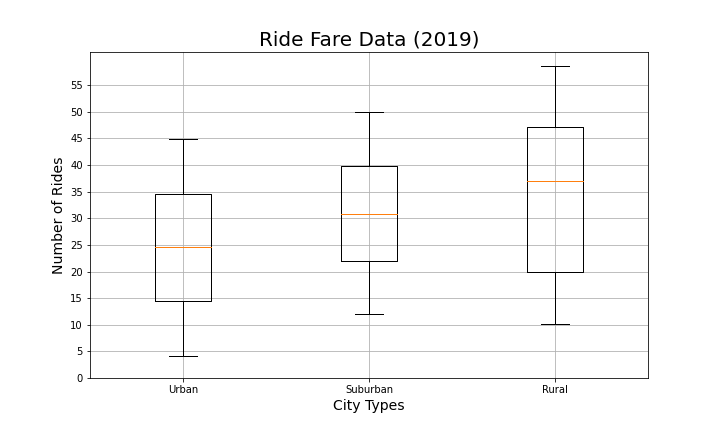
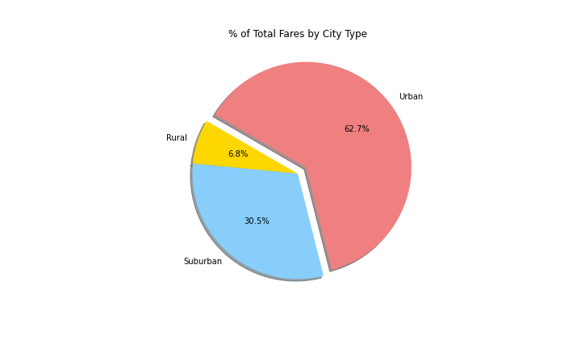
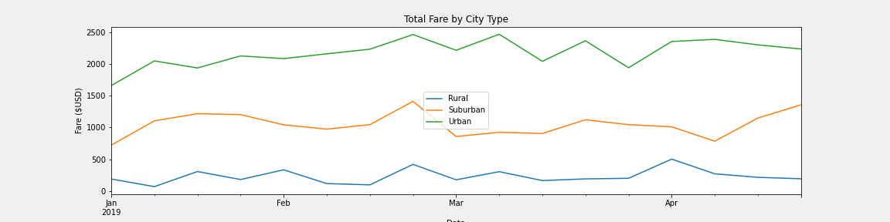

# PyBer_Analysis

## Project Overview
First using Python and Pandas, we will create a summary Dataframe of the ride-sharing data type by city. Next using Pandas and Matplotlib we will create a multiple-line graph showing the total weekly fares for each city type. This project will then summarize how the data differs by city type for executives at Pyber in assisting them with future investments and company growth. 

## Resoures
- **Software:** Python 3.9.1, Jupyter Notebook 6.0.3
- **Data Sources:** [PyBer_ride_data.csv](https://github.com/r3ginam/PyBer_Analysis/blob/main/Resources/PyBer_ride_data.csv), [city_data.csv](https://github.com/r3ginam/PyBer_Analysis/blob/main/Resources/city_data.csv)

## Results

  

The scatter chart shows that the total number of rides per city in order are Urban, Suburban, and Rural. Although Urban cities have the highest frequency of rides, the data shows that the highest fares belong to the Rural cities. One theory to suggest: more people take shorter rides in Urban cities, while Rural trips are longer.

  

The boxplot above show the mean numbers for each city type as follows: Urban-24.62 rides, Suburban-17.36 rides, and Rural-6.94 rides. There is also one outlier in Urban rides shown above.

  

This boxplot suggests a different story when it comes to the mean fares of city type: Urban-24.52, Suburban-30.97, and Rural-34.62. There are no outliers found in this data. This aligns with our above theory. 

  

Urban cities still dominate Pyber's revenues at 62.7% even with the lowest fair mean. 

  

Here our pie chart shows that 68.4% of all rides come from Urban cities. One cavet to mention is that Suburban cities account for 26.3% of the total rides while bringing in 30.5% of the total revenue. 

  

Shown above, we have a very telling piece of pie. Rural cities account for 2.6% of total drivers by city type and are responsible for 6.8% of the revenue. likewise Suburban cities only represent 16.5% of the total drivers while accounting for 30.5% of the total revenue. Only the Urban cities have a higher percentage of the drivers at 80.9% but only bring in 62.7% of the fares. This could suggest that fewer drivers are needed in urban areas, and more are needed in rural and suburban areas.

  

Lastly, the total fares are shown for the months of January through April 2019. With the exception of slight spikes in all three city types, It is fair to say that fare totals stay mostly consistant throughout the year. 

## Summary

We recommend the following to you CEO based on the data:

1.Higher more drivers in Suburban cities. Suburban drivers account for only 16.5% of the total drivers while accounting for 30.5% of the total revenue. This 14% difference suggest Suburban drivers are working hard and could use some help! 
2.Explore further into the Rural cities marketplace. Specifically discovering if having so few drivers in these areas is costing you rides. Look into total ride requests compared to rides given. 
3.

