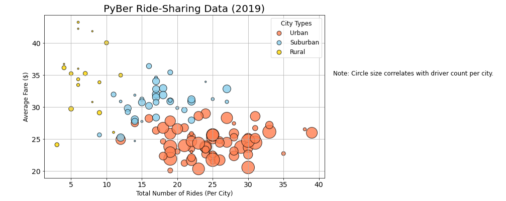

# PyBer_Analysis

## Project Overview
First using Python and Pandas, we will create a summary Dataframe of the ride-sharing data type by city. Next using Pandas and Matplotlib we will create a multiple-line graph showing the total weekly fares for each city type. This project will then summarize how the data differs by city type for executives at Pyber in assisting them with future investments and company growth. 

## Resoures
- **Software:** Python 3.9.1, Jupyter Notebook 6.0.3
- **Data Sources:** [PyBer_ride_data.csv](https://github.com/r3ginam/PyBer_Analysis/blob/main/Resources/PyBer_ride_data.csv), [city_data.csv](https://github.com/r3ginam/PyBer_Analysis/blob/main/Resources/city_data.csv)

## Results

  

